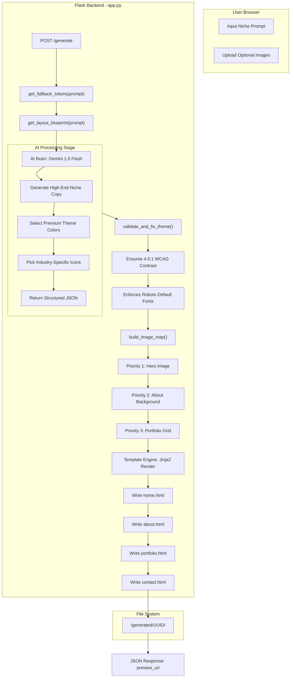

# Pomeli Website Builder: System Architecture & Flow

This document provides a simplified overview of how the website generator works, from the moment a user submits a prompt to the final static website generation.

---

## 🚀 The Core Workflow (Detailed Breakdown)

---

## 📂 Folder & File Structure

### 1. **`app.py` (The Engine)**
The main server file. It handles:
- **Routes**: `/generate`, `/preview`, `/download`.
- **AI Logic**: Sends instructions to Gemini to act as a "Creative Director."
- **Theme Guard**: Ensures the AI doesn't pick bad colors or unreadable fonts.
- **File System**: Manages uploaded images and the generated website folders.

### 2. **`/templates` (The Blueprint)**
HTML files using the **Jinja2** engine. They define the "Architectural Hybrid" design:
- **`base.html`**: The global styling, navigation, and footer.
- **`home.html`**: The main landing page with modular sections.
- **`about.html`**, **`services.html`**, **`portfolio.html`**: Secondary pages.

### 3. **`/uploads` & `/generated`**
- **Uploads**: Temporary storage for user-submitted images.
- **Generated**: Permanent storage for finished websites (organized by unique UUID).

---

## 🛠 Step-by-Step Deep Dive

### Step 1: User Input
The user enters a niche (e.g., "Handmade Bakery") and optionally uploads photos.

### Step 2: AI Brain (Gemini)
The system tells Gemini: *"You are an elite Creative Director. Write copy for a Bakery. Use specialized terms like 'Artisanal Fermentation.' Pick 4 specific services."* Gemini returns a clean JSON block.

### Step 3: The Theme Guard
Before rendering, the code checks the AI's colors. If the background and text are too similar, it automatically adjusts them for perfect legibility and a "real" professional look.

### Step 4: Strategic Image Mapping
The system intelligently places images. The best one goes to the **Hero**, the second-best to the **About** section, and the rest to the **Portfolio**. If no images exist, it pulls niche-perfect fallbacks from Unsplash.

### Step 5: Final Rendering
The Flask app merges the AI's copy + the site's theme + the image paths into the HTML templates, creating a set of finished, high-performance static pages.

---

## 📄 Final Result
The user receives a **Preview URL** where they can see their unique, professional, and "non-AI looking" website instantly.

